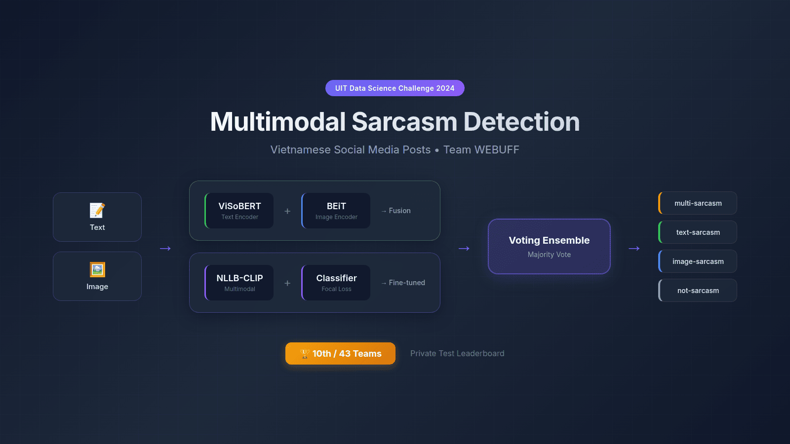
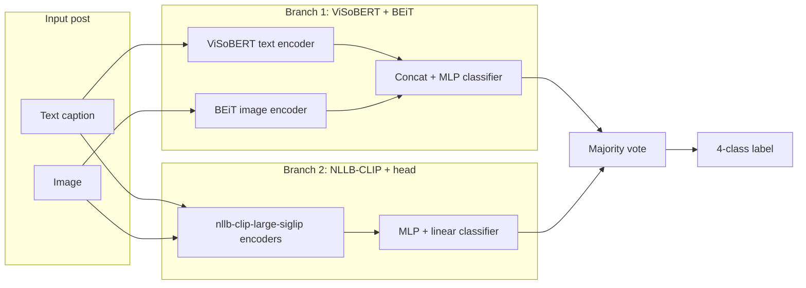

# Multimodal Sarcasm Detection (Vietnamese Social Media)

**Team WEBUFF — [UIT Data Science Challenge 2024](https://github.com/dinhthienan33/DSC2024_WEBUFF)**  
Detect sarcasm in Vietnamese posts where the signal may appear in **text**, **image**, or **both**.



| | |
|---|---|
| **Task** | 4-way multimodal classification |
| **Competition** | UIT Data Science Challenge 2024 (ViMMSD-style sarcasm track) |
| **Private leaderboard** | **10th of 43 teams** |

---

## Overview

Social-media sarcasm is inherently multimodal: a neutral caption can pair with a mocking image, or sarcasm may live only in the text. This repository contains the training and inference notebooks used by **team WEBUFF**, plus JSON predictions and a small **majority-vote ensemble** script.

**Label space (4 classes):**

| Label | Meaning |
|-------|---------|
| `text-sarcasm` | Sarcasm only in the caption/text |
| `image-sarcasm` | Sarcasm only in the image |
| `multi-sarcasm` | Sarcasm in both modalities |
| `not-sarcasm` | No sarcasm |

The challenge data are **not** redistributed in this repo. Notebooks assume Kaggle datasets under paths such as `/kaggle/input/dsc2024/` (images, `vimmsd-private-test.json`, and CSV splits).

On the full training CSV used in `visoBert_Beit.ipynb` (`train_ocr.csv`, 10,805 posts), class counts are:

| Label | Count |
|-------|------:|
| `not-sarcasm` | 6,062 |
| `multi-sarcasm` | 4,224 |
| `image-sarcasm` | 442 |
| `text-sarcasm` | 77 |

---

## Approach

Two independent models are trained, then combined with **majority voting** at inference time.



### Branch 1: `visoBert_Beit.ipynb`

- **Text:** [uitnlp/visobert](https://huggingface.co/uitnlp/visobert) (`[CLS]` features).
- **Image:** [microsoft/beit-base-patch16-224](https://huggingface.co/microsoft/beit-base-patch16-224) (`[CLS]` features).
- **Fusion:** concatenate features → MLP (512 hidden, dropout 0.3) → linear 4-class head.
- **Training:** AdamW, cosine schedule, mixed precision (`torch.cuda.amp`), `CrossEntropyLoss`; 90/10 train/dev split (`random_state=42`). Documented run settings in the notebook include 10 epochs, batch size 32, learning rate `1e-5`, `max_seq_length` 512.
- **Text prep:** lowercasing, emoji normalization, light cleaning (see notebook).

### Branch 2: `nllb-clip-large-siglip_v2.ipynb`

- **Backbone:** OpenCLIP `nllb-clip-large-siglip` (pretrained `mrl`); image/text towers are **frozen**; features are concatenated and passed through a **trainable** MLP + classifier.
- **Training:** `CrossEntropyFocalLoss` (pytorch-toolbelt) with class weights, `WeightedRandomSampler` oversampling, AdamW + cosine warmup (2,000 steps), mixed precision, gradient clipping (`max_norm=1.0`).
- **Hyperparameters in notebook:** 30 epochs, batch size 256, learning rate `1e-2`, weight decay `0.001`.
- **Data:** `train_cluster.csv` on Kaggle (same label schema).

### Ensemble: `ensemble/main.ipynb`

Loads per-model private-test JSON files (`visobertbeit.json`, `clip.json`, `clipv2.json`), aligns predictions by sample ID, and applies **majority vote**. Output is written to `ensemble/results.json` (`phase`: `test`, 1,504 samples).

---

## Results

| Metric | Value |
|--------|-------|
| **Private test rank** | **10 / 43** (UIT DSC 2024) |

No official accuracy or F1 scores are checked into this repository; dev-set `classification_report` cells in the notebooks were not saved with executed outputs. Leaderboard rank is the verified competition result.

---

## Repository structure

```
DSC2024_WEBUFF/
├── visoBert_Beit.ipynb          # ViSoBERT + BEiT training & inference
├── nllb-clip-large-siglip_v2.ipynb  # OpenCLIP classifier training & inference
├── ensemble/
│   ├── main.ipynb               # Majority-vote ensemble
│   ├── visobertbeit.json        # Branch-1 test predictions
│   ├── clip.json                # Branch-2 predictions (run A)
│   ├── clipv2.json              # Branch-2 predictions (run B)
│   └── results.json             # Final voted predictions
├── docs/
│   └── assets/
│       └── card.png             # README / portfolio card (1600×900)
└── README.md
```

---

## Setup and usage

Training was run on **GPU** (Kaggle: Tesla T4). Reproduce by uploading the notebooks to Kaggle or a similar environment with the competition datasets attached.

### Dependencies (install as in notebooks)

**ViSoBERT + BEiT** (typical stack):

```bash
pip install torch torchvision transformers scikit-learn pandas pillow tqdm matplotlib
```

**NLLB-CLIP branch:**

```bash
pip install torch==2.4.0 torchvision==0.19.0 --index-url https://download.pytorch.org/whl/cu124
pip install open_clip_torch
pip install git+https://github.com/BloodAxe/pytorch-toolbelt.git
pip install transformers scikit-learn pandas pillow tqdm
```

### Workflow

1. **Train or load weights** in each notebook (paths point to Kaggle inputs; adjust `IMAGE_*_FOLDER` and CSV paths for your environment).
2. **Export predictions** as JSON with schema `{"results": {"<id>": "<label>", ...}, "phase": "test"}`.
3. **Ensemble:** place prediction files in `ensemble/`, open `ensemble/main.ipynb`, run all cells (or execute the voting logic in `main.ipynb`) to produce `ensemble/results.json`.

Pretrained weights are **not** included in this repository; obtain them from your own training runs or competition artifacts.

---

## Team and contact

**Team WEBUFF** — UIT Data Science Challenge 2024.  
Maintainer: [Đinh Thiên Ân](https://github.com/dinhthienan33) · [Portfolio](https://portfolio.dinhthienan203.id.vn)  
Questions: dithienan03@gmail.com

---

## Citation

No paper or technical report is bundled with this repository. If you use this code, please cite the UIT Data Science Challenge 2024 and link to this repo:

```text
Đinh Thiên Ân et al. (Team WEBUFF). Multimodal Sarcasm Detection for Vietnamese Social Media.
UIT Data Science Challenge 2024. https://github.com/dinhthienan33/DSC2024_WEBUFF
```

---

## License

License: **not yet specified**. Add a `LICENSE` file in the repository when terms are chosen.
